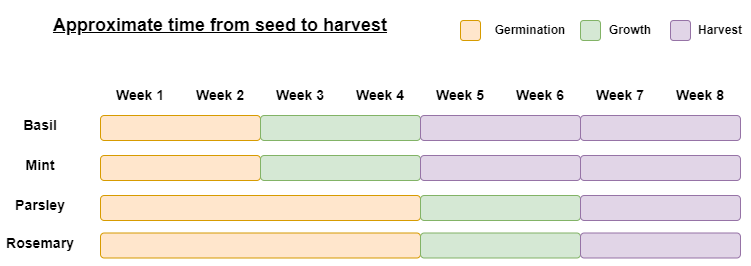

# Planting your herbs

This section outlines the best times for planting herbs and the best practices for each of the four herbs.

## Table of contents
- [When to plant](#when-to-plant)
- [Prepping the soil](#prepping-the-soil)
- [Sowing the seeds](#sowing-the-seeds)
- [Plant sprouts](#plant-sprouts)

## When to plant

When planting most plants, the time of year to plant seeds can vary depending on location. As you are planting your seeds indoors, you can sow them at any time of year, though I would recommend sowing in early springtime if you do not have access to a grow light, in order to avail of the natural sunlight. The following diagram serves as a guideline as to how long it should take for each plant to go from seed to mature. 

## Prepping the soil 

Before you sow your seeds, ensure that you have prepared your soil. All four of your chosen herbs enjoy a **well-draining** soil; so to increase the porosity of our soil, we can add _perlite_. 

_Perlite_ is a lightweight, granular material that is coloured white. By adding it to your soil, you increase aeration, keeping the soil loose and well-draining. A 1:1 ratio of perlite to soil is recommended for your herbs. 

Add a small amount of water to the soil mix - enough that it is moist but not too damp. This will encourage roots to sprout and your seeds to grow. 

## Sowing the seeds

Your herbs each require slightly different parameters for sowing, so they will be discussed individually. 

### Basil 

Basil seeds are quite small and black in colour. When planting Basil, fill your pot to half an inch - inch below the top with soil. Plant a few seeds in the soil; Do this in case some of the seeds do not sprout. Top the exposed seeds with a light layer of spoil and give them a gentle splash of water. 

Once you have done this, cover the top of the pot with plastic wrap or a plastic dome to keep moisture in. You should not need to water the pot again until the plants sprout. 

Place the plot in a warm location and wait for seedlings to appear. Germination should take about two weeks.

### Mint

Mint seeds resemble peppercorns in shape and colour, though they are a degree smaller. When planting Mint, sow the seeds on top of the soil and leave them uncovered. The seeds require light to germinate. Like Basil, they do need to be covered with plastic wrap or a dome to keep moisture in.

Place the pot in a spot that is warm and bright but out of direct sunlight. The seeds should germinate in two weeks.

### Parsley

Parsley seeds are brown and have a tear-drop shape. When planting them, fill your pot almost to the top with soil. Parsley seeds should be somewhat spread out, six to eight inches apart if possible, so take care to give them space when you sow them. Cover the seeds with a quarter-inch more soil and give them a little bit of water. 

Ensure you check on your Parsley routinely and give the pot a small amount of water if the soil seems to be getting dry. It can take between two and four weeks for seedlings to appear. 

### Rosemary

Rosemary seeds look like thinner, smaller acorns without helmets. This herb enjoys quite fine soil, so if possible, add a bit more _perlite_ to your potting mix for this plant. Sow your seeds, top them with a light dusting of soil, water lightly, and cover with plastic wrap or dome. 

Ensure you place the pot in a warm location that receives plenty of direct sunlight. The rate of germination in Rosemary is lower than that of, say, Basil, so expect for there to be less plants sprouting. Germination should occur in two to four weeks. 

## Plant sprouts

When you see little plants sprouting from the soil, remove the plastic wrap or dome to give them some room to grow. Transfer any plants that were not in direct sunlight over to your sunniest spot. 

To ensure your plants grow big, strong roots, fill a shallow dish with water and place the containers in it. The water should soak into the soil from the drainage holes in the bottom of the container, which encourages roots to grow down into the soil. Continue to water your plants in this way once per week. 