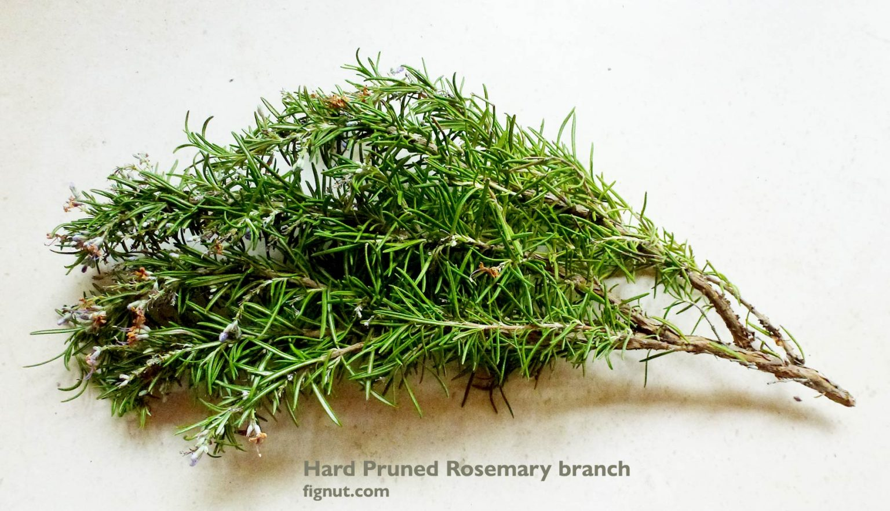
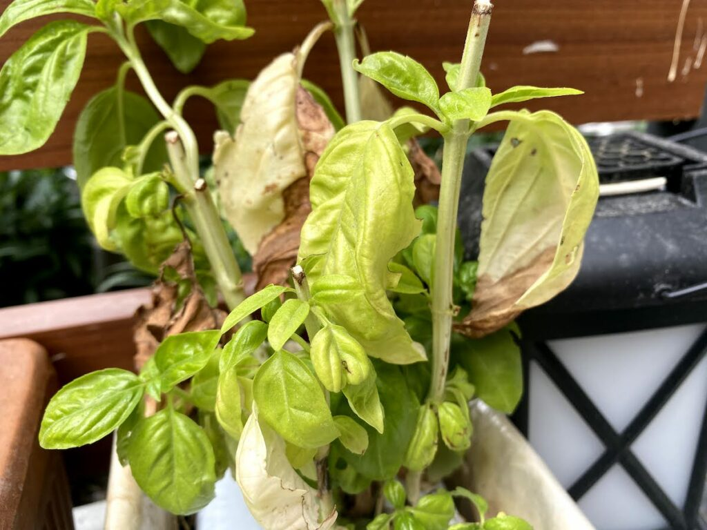
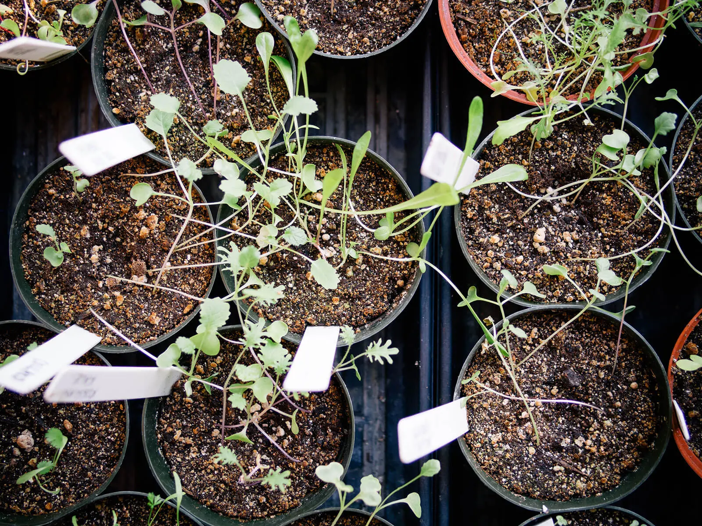

# Caring for your plants

After your plants have sprouted they will require care to thrive. This section will outline some best practices for caring for you plants.

## Table of contents
- [Pruning](#pruning)
- [Harvesting](#harvesting)
- [Fertilising](#fertilising)
- [Potential issues](#potential-issues)

## Pruning

Once the plants have grown six leaves (three sets) you can begin to prune the plant to encourage bushier growth. You do not need any fancy equipment to prune plants, simply pinch the site of new growth with your thumb and forefinger and pull the leaves from the plant. This will encourage new shoots to sprout from the site of the plucked leaves. Ensure your hands are clean before you prune with them. 
You can continue to do this as often as you like to encourage more shoots to grow, but take care to never remove more than a third of the plant at a time. 

To prune Parsley as it gets bigger, you may want to use scissors to cut stems as close to the base as you can, around an inch from the soil. It should take about a week for new growth to appear. 

It is especially important to prune Rosemary and Mint. 
Rosemary is prone to getting "woody", which means the main stem of the plant becomes tough and wood-like. This part of the plant will not produce any leaves or shoots, so it is important to keep pruning Rosemary to keep the plant producing leaves for use.

Mint is an enthusiastic grower and will quickly fill out your pot. To ensure it is kept under control, prune the stems of your Mint plant to keep it compact.

Take care to remove any flower buds that appear on your plants. While flowers mean that a plant is happy, they will result in your herbs discontinuing the growth of leaves. As such, they must be cut back to ensure your plant continues to be viable for the growing season. 

## Harvesting

- To harvest Basil and Mint, you can pull the leaves from the plant whenever they are needed. 
- To harvest Parsley, cut the stem as close to the soil as you can. You should cut the stems on the outside of the plant first. 
- To harvest Rosemary, cut about three quarters of a stem, leaving the last quarter with some leaves intact. 

The best time to harvest your herbs is in the morning, when the essential oils in the leaves are at their most potent. 

During winter months, when the temperature is colder, plants go into a state of dormancy, where they slow down their growth. Try to harvest before this and keep some herbs to use in winter instead of harvesting in winter. 

## Fertilising

Your plants may benefit from a nutritional boost from time to time. To fertilise your plants, take any liquid fertiliser made for tomatoes and add a couple drops to your watering can. Ensure you __do not__ get any of the water on the leaves or stem, but water the soil around the base of the plant. You should fertilise your plants every three or four weeks during the growing season. 

Mint __does not__ need fertilising, as it is already quite a fast growing plant, so do not feed it. 

## Potential issues

There are a few common issues that can arise when growing herbs for the first time. 

"Bolting" is an issue with herb plants putting out flowers instead of focusing on growing leaves. This occurs if the plant is too hot, so if your plants start producing flowers prematurely, consider moving them to a space with good airflow to keep them cool and cut the flowers back. 

If the leaves on your plant are curling or turning yellow, the plant is usually trying to retain moisture. If this occurs when the soil is wet, it means the roots are waterlogged. Water your plant more often, or cut back on watering and ensure your container has good drainage to solve this. 

If your plant begins to grow very long and spindly with sparsely placed leaves, it is searching for more light. Move the plant into a sunnier spot or consider buying a grow light to supplement light for your plant. 

